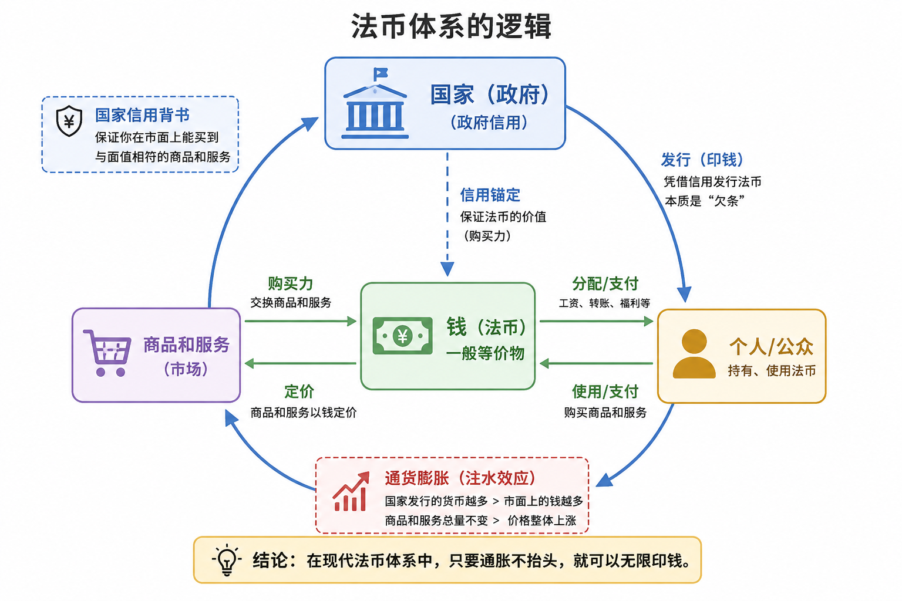
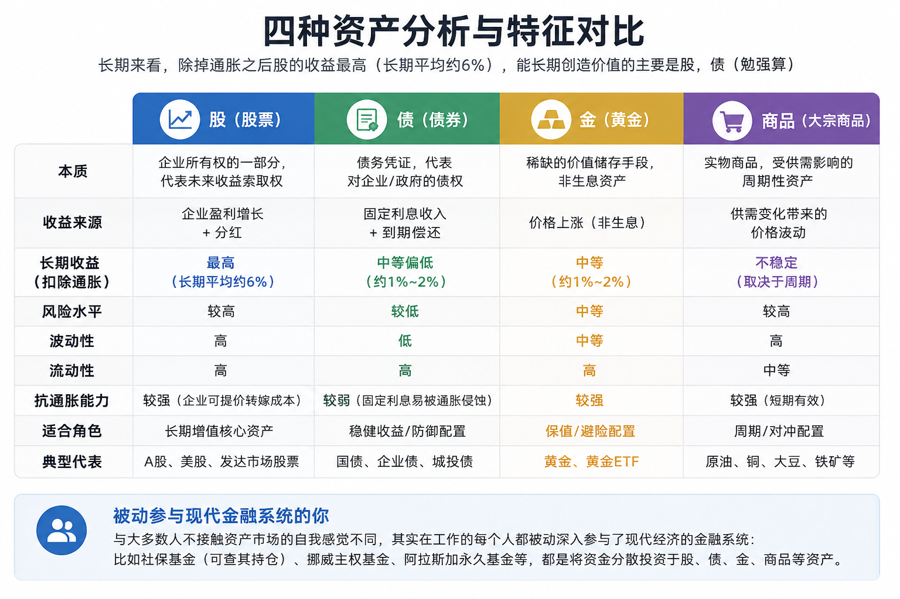
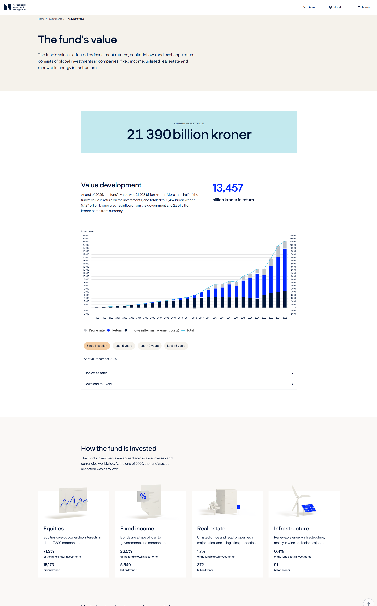
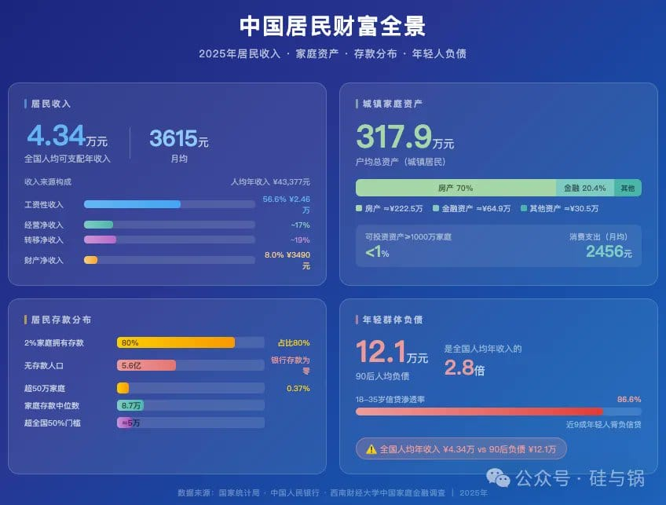
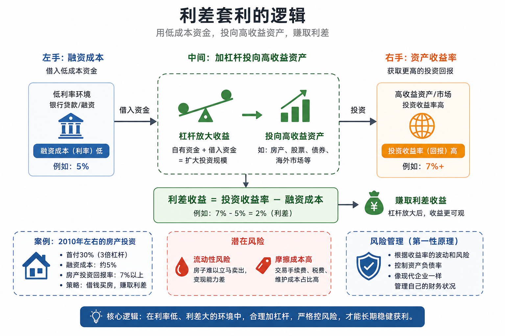

## 一些财务知识

受益于大学期间读过的经济学教材，我对个人财务和宏观经济有了基本的概念框架。上班之后有了自己的收入，便开始动手构建自己的财务体系。反复和 AI 以及身边有投资经验的朋友交流下来，我越来越觉得优化个人财务以及理解经济的思路能帮自己避开许多坑，并为个人的决策提供支撑。

### 钱到底是什么

先从最基本的问题聊起。经济学教科书上有一个经典定义：钱是一般等价物，也就是说钱是一把“万能尺子”，可以用它衡量和交换市面上几乎所有的商品和服务。一部手机值 5000 块，一顿饭值 30 块，都是在用这把尺子在标价。

但历史告诉我们，这把尺子本身并不是固定不变的。我家附近的包子铺，2008 年的时候一个大肉包 5 毛钱，到了 2026 年，同样的包子卖 2 块。东西还是那个东西，但价格变了，钱能换到的东西变少了。这就是**通货膨胀**。

现代货币可以理解为一种由国家信用和金融体系共同支撑的支付凭证。国家、中央银行、商业银行，会通过财政、信贷、金融体系扩张等方式，让市场上的货币总量逐步增加。货币变多，不一定立刻带来全面通胀，因为它还要看生产效率、需求强弱、居民预期、国际环境等很多因素；但从长期看，现金购买力往往很难保持原地不动。

这就像往一个池子里持续注水。池子本身也许会变大，排水速度也会变化，所以水位不会每时每刻都直线上涨；但如果长期注水的速度快于池子的承载能力，水位大概率还是会抬高。放在经济里，水就是货币，水位就是物价和资产价格。

同事跟我讲过一个身边的真实例子：他家亲戚里有个老人，不信房子、不信黄金、不信股票，就只相信攥在手里的现金。从 2012 年到现在，坚定地持有 10 万块现金不动。十几年过去了，数字没变，还是 10 万，但能买到的东西已经缩水了不少。

这就是每个人在货币体系里面对的第一个、也是最根本的风险：**通胀风险**。它是一种静悄悄的结构性力量，就像重力一样，不断蚕食现金的购买力。

想到这里，我会觉得，通胀带来的压力最后通常会把人推向两个方向：一边是努力维持稳定现金流，另一边是去理解哪些资产更有可能承接长期储蓄。

### 中国人的买房情结，和市面上可选的资产

上班以来，买房几乎是每次和同事闲聊时绕不开的话题。让我印象很深的是，身边一些 35 岁左右的同事，2020 年前后上的车，这几年账面价格明显回撤。对很多家庭来说，房子第一次变成了一笔会波动、会占用现金流、也可能带来焦虑的资产。

更准确地说，是那个阶段的制度环境、信贷条件、居民预期和社会文化，共同塑造了“房子最安全”的共识。只是今天回头看，很多人开始意识到：房子除了是居住品，也是资产；只要是资产，就必须放到收益、风险、流动性这三个维度里一起看。

资产就是一种能在未来提供现金流、保值能力，或者价格上涨可能性的东西。这是我用来理解问题的一种粗略分类：**现金、股票、债券、黄金、房地产，以及更广义的大宗商品**。

先看房子。对大多数中国家庭来说，房子既是生活资料，也是资产负债表里最大的一项。它的优点很明显：看得懂、摸得着，还能住；缺点也同样明显：金额大、交易成本高、流动性差，而且收益高度依赖城市和买入时点。

以租金回报率为例，不同城市差异非常大，但过去几年不少热点城市的住宅租金回报率确实偏低，一线和强二线里常见的是 1% 到 2% 多一点的区间。再扣除持有成本、空置、维修、税费，以及通胀因素后，实际回报未必有想象中高。更麻烦的是，房子还有个致命弱点：**不好卖**。想用钱的时候，它不一定能按你希望的价格和速度变现。

不过反过来看，对租房的人来说，当前很多城市的租售比其实比以前友好多了。也就是说，用相对没那么高的租金，就能享受一套本来很贵的房子的居住服务。对一部分年轻人而言，这也可能是权衡收益、风险和自由度之后，主动做出的更优选择。

说完了房子，再看更广义的资产世界。长期来看，真正能够持续跑赢通胀的，往往还是少数几类高生产性或稀缺性资产。以长期全球数据看，股票的长期真实回报通常最高；债券回报相对低一些，但波动通常也更低；黄金更像一种在极端环境下提供对冲的资产；大宗商品则更多受经济周期影响。

长期来看，扣掉通胀之后，股票的真实回报往往仍然是主要大类资产里最可观的。以 UBS 发布的《Global Investment Returns Yearbook》长期数据为参考，全球股票在过去一百多年的长期真实回报大致可以理解为年化 5% 到 6% 左右，但中间会经历非常剧烈的波动。这背后的逻辑是：股票代表的是企业未来持续创造利润的能力，而这种能力，长期通常比单纯持有现金更能抵御通胀。

注：这类长期收益图通常引用的是全球跨市场长期历史数据，适合理解“方向”，不适合直接拿来预测未来几年。

很多人觉得自己从不碰投资、跟金融市场没关系，但其实每个人都已经深度参与了这个系统。比如社保基金，本身就是一个巨大的投资组合；挪威的国家主权基金、阿拉斯加的永久基金，本质上也都是在帮国民做资产配置。

从现有公开调查数据看，中国城镇居民家庭的资产大头长期以来都集中在住房上。人民银行 2019 年城镇居民家庭资产负债调查曾给出一个很有代表性的结果：住房资产在家庭总资产中占比较高，住房仍然是居民财富的核心载体。这意味着什么？意味着很多家庭虽然“看起来有钱”，但财富高度集中在一个流动性较差、区域差异很大的资产上。

所以，中国家庭财富过度集中在房子上，本身就是一种很值得记下来的结构性现象。

### 每个人的选择，都有财务驱动的因素

家庭层面聊完了，下面落到个人身上。

当下中国社会有一套标准的人生流水线：上学，上班，结婚，生娃。但每一个选择的背后，都牵扯到一笔长期资金分配。

先从上学说起。我们通常把教育看作“提升自己”，这当然没错；但从经济运行的角度看，教育也确实带有很强的投资属性。家庭投入了十几年的时间和大笔学费，产出的是知识、技能、文凭、社交网络，以及未来更高收入的可能性。这就引出了一个概念：教育的投入产出比。

这些年，随着经济增速放缓、行业分化和就业竞争加剧，很多家庭都开始更现实地看待教育投资这件事。不是说教育不值得，而是它不再像过去那样，对所有人都自动兑现同样高的回报。读什么专业、在哪个城市、进入什么行业、是否具备持续学习能力，这些变量，都会极大改变回报结果。

所以更稳妥的说法不是“教育不值钱了”，而是：教育回报的分化，比以前更明显了。有人拿到的是高回报，有人拿到的是普通回报，也有人投入很大却回报平平。我现在会把“投资自己”理解得更具体一点，不只是读书本身，还包括学习能力、表达能力、协作能力，以及跨领域适应能力。

至于结婚和生娃，也可以用类似的视角去理解。它们当然不只是财务决策，更是价值观和生活方式的选择；但财务约束确实会深刻影响人们是否愿意进入这些安排。当住房、教育、养育成本和收入预期之间出现明显错配时，越来越多人延后或放弃某些传统路径，本身就是一种可以理解的理性反应。

### 借钱投资的思维：利差和杠杆

最后聊一个稍微进阶一点的话题：用别人的钱来赚钱。

金融世界里有个非常诱人的逻辑，叫“利差”。如果你能用较低的成本借到钱，再把这笔钱投入一个长期预期回报更高的地方，中间就存在赚钱的空间。上世纪 90 年代之后，日本低利率环境下广为人知的“日元套息交易”，本质上就是这种思路的放大版。

但我越来越觉得，不能把“有利差”直接理解成“这件事就值得做”。因为账面上的利差，只是故事的开头，不是结尾。

当左手能以较低成本拿到钱，右手又看到了一个收益率更高的投资标的时，表面上看，杠杆确实能放大收益。比如自己出 100 块，再借 400 块，凑 500 块去投；如果投资涨了 10%，赚的是 50 块，相当于本金回报 50%。但反过来，一旦资产跌了 10%，亏损也会被同步放大。

所以在这件事上，我最后记住的是风险会不会先一步失控。杠杆是否成立，背后依赖的其实是现金流、负债成本、资产波动和对最坏情况的承受能力。

举一个最熟悉的例子：2010 年前后，在中国很多城市，买房确实曾经是一种典型的“低成本负债配置高增长资产”的模式。首付 30%，意味着天然带杠杆；房贷利率和房价上涨之间，在一段时期里也确实存在正向利差。问题在于，这个模式成立，依赖的是特定时代的城镇化、信贷扩张、居民预期和房地产制度红利。时代变了，条件变了，过去有效的公式就未必还能照搬。

更重要的是，房子这种资产还有两个天然问题：第一，**变现难**；第二，**摩擦成本高**。交易税费、中介费、装修折旧、物业维护，都会一点一点侵蚀掉表面收益。所以现在回头看，会觉得对杠杆的理解，最后还是会落回到一个很朴素的问题上：自己到底能不能承受它。

通胀是一个长期存在、但经常被低估的问题。带来这个问题的法币体系则意味着长期只持有现金，往往很难守住购买力。

写到最后，我还是会回到最开始那个朴素的判断：有些东西会随着货币扩张和资产价格波动而起伏，有些东西不会。知识、技能、人际关系、学习能力，这些未必每一年都立刻兑现收益，但决定了个人在周期里还能不能保有选择权。

---

## 参考文献

1. UBS. *Global Investment Returns Yearbook*. 文中关于全球股票长期真实回报的表述，主要参考该报告的跨市场长期历史数据。
2. 中国人民银行调查统计司. *2019 年中国城镇居民家庭资产负债情况调查*. 文中关于中国城镇家庭资产以住房为主的表述，主要参考该调查结果。
3. 国家统计局. *居民消费价格指数（CPI）年度数据*. 文中关于通胀的讨论，若落到具体年份，应以国家统计局公布的 CPI 数据为准。
4. 重点城市住房租赁市场公开研究资料. 文中关于住宅租金回报率偏低的表述，主要依据近年重点城市公开报告中的常见区间整理，不代表所有城市都处于同一水平。
